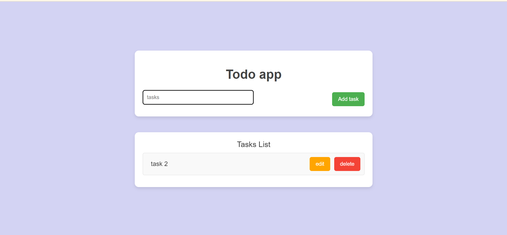

To-Do App
A simple, lightweight to-do app that allows users to add, edit, and delete tasks.

Features

Add Tasks: Users can add new tasks to the to-do list.

Edit Tasks: Users can edit the details of existing tasks.

Delete Tasks: Users can remove tasks from the to-do list.

Responsive Design: The app is designed to be mobile-friendly and works well on various devices.

Image of the page

Getting Started
To get started with the  To-Do App, follow these steps:

1. Clone the repository:

git clone [https://github.com/Natnael-Worku/Task_one_todo_app/]

2. Navigate to the project directory:

cd Task_one_todo_app

3.Open the index.html file in your preferred web browser.

4.Open the index.html using the liveserver

Technologies Used
HTML
CSS
JavaScript
